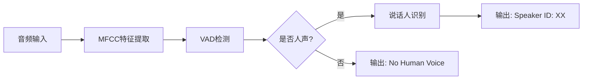

# VESC 2025 智能语音识别系统

## 项目概述

本项目是2025年芯原杯全国嵌入式软件开发大赛的决赛作品，实现了基于VeriHealthi SDK的语音数据采集、蓝牙发送及人声检测和说话人识别功能。系统采用两级级联算法架构（VAD + SPK），在RISC-V嵌入式平台上实现实时语音识别。

### 核心功能
- ✅ **人声活动检测（VAD）**：区分人声与环境噪声、音乐、动物声等
- ✅ **说话人识别（SPK）**：识别特定目标说话人（小芯、小原、小思、小来）及其他说话人
- ✅ **实时音频处理**：PDM数据采集、MFCC特征提取、模型推理
- ✅ **蓝牙数据传输**：算法结果推送、原始音频数据发送
- ✅ **嵌入式优化**：INT8量化、NMSIS-NN加速、内存管理

### 技术特点
- **轻量化设计**：总模型大小 < 25KB，满足嵌入式内存限制
- **高效推理**：处理延迟 < 1秒，支持实时识别
- **跨设备兼容**：多设备数据训练，确保部署一致性
- **工程化完整**：从算法研发到嵌入式部署的完整链条

## 项目结构

```
final_algo/
├── VAD/                          # 语音活动检测模块
│   ├── VAD_train_mfcc.ipynb    # VAD模型训练主文件
│   ├── vad_brd_only/            # 训练数据集（按设备分类）
│   ├── vad_model_quant_mfcc12_cls2_sigmoid.tflite  # 量化模型
│   └── vad_model_quant_mfcc12_cls2_sigmoid/        # C代码导出
│
├── SPK/                          # 说话人识别模块
│   ├── OFFICIAL_all.ipynb      # SPK模型训练主文件
│   ├── OFFICIAL/                # 多设备数据集
│   ├── checkpoints/             # 训练检查点
│   └── spk-OFFICIAL_ALL-NO_NOISE_hid512_9X12/     # 最佳模型
│
├── EMBD/                         # 嵌入式代码生成
│   ├── EMB.ipynb               # 嵌入式参数导出
│   └── export_params_lib/       # 参数导出工具
│
├── submission_final/             # 最终提交版本
│   ├── Overall_pipline.ipynb   # 完整测试流水线
│   ├── myutils/                 # 数据处理工具集
│   ├── params_export_utils/     # 参数导出工具
│   └── *.tflite                # 量化模型文件
│
├── legacy/                      # 文档存档
│   ├── VESC2025决赛设计文档-西部赛区-电子科技大学-自动化摸鱼队.md
│   └── PROMPT.md               # 项目说明
│
└── 决赛设计文档-算法设计部分.md   # 算法技术文档
```

## 算法架构

### 1. 两级级联设计


### 2. VAD（语音活动检测）
- **网络结构**：单卷积层 + 全局平均池化 + 全连接
- **输入特征**：31帧×12维MFCC
- **模型大小**：2.8KB（770参数）
- **准确率**：77.8%

### 3. SPK（说话人识别）
- **创新设计**：9×12满维度卷积核
- **网络结构**：大尺寸卷积 + 全局池化 + 全连接
- **支持类别**：5类（4个目标说话人 + Others）
- **模型大小**：22KB

### 4. 关键技术创新
- **9×12满维度卷积**：时域9帧覆盖音素长度，频域12维实现类似全局注意力的频域建模
- **多设备加权训练**：BOARD(43%) + DIY(26%) + 其他设备，解决域偏移问题
- **知识蒸馏VAD**：使用Silero教师模型自动标注，提高训练效率
- **端到端量化**：完整的INT8量化流程，PC-QEMU数值对齐

## 快速开始

### 环境要求
- Python 3.8+
- TensorFlow 2.x
- NumPy, librosa, scipy
- Jupyter Notebook

### 1. 数据准备
```bash
# 解压数据集到对应目录
# VAD数据：VAD/vad_brd_only/
# SPK数据：SPK/OFFICIAL/
```

### 2. 模型训练

#### VAD模型训练
```bash
cd VAD/
jupyter notebook VAD_train_mfcc.ipynb
```

#### SPK模型训练
```bash
cd SPK/
jupyter notebook OFFICIAL_all.ipynb
```

### 3. 模型评估
```bash
cd submission_final/
jupyter notebook Overall_pipline.ipynb
```

### 4. 嵌入式部署
```bash
cd EMBD/
jupyter notebook export_param.ipynb
```

## 性能指标

### 模型性能
| 模型 | 大小 | 准确率 | 延迟 | 内存占用 |
|-----|------|--------|------|----------|
| VAD | 2.8KB | 77.8% | <50ms | <10KB |
| SPK | 22KB | >90% | <200ms | <40KB |

### 系统性能
- **实时性**：处理延迟 < 1秒/段
- **更新频率**：1Hz（可配置）
- **蓝牙传输**：8000 SPS采样率，100%准确率
- **稳定性**：连续运行30分钟无故障

## 使用方法

### 1. 完整测试流水线
```python
# 运行完整测试
cd submission_final/
jupyter notebook Overall_pipline.ipynb

# 执行所有单元格，查看：
# - 数据加载与预处理
# - 模型推理结果
# - 性能评估报告
# - 可视化分析
```

### 2. 单独使用工具
```python
# MFCC特征提取
from myutils.extract_mfcc import extract_mfcc_features
features = extract_mfcc_features(audio_path)

# 音频混合
from myutils.wav_mix import mix_audio_with_noise
mixed = mix_audio_with_noise(speech, noise, snr_db=10)

# VAD检测
from myutils.silero_vad_script_prob import detect_voice_activity
vad_result = detect_voice_activity(audio_file)
```

### 3. 模型推理
```python
# 加载量化模型
import tensorflow as tf
interpreter = tf.lite.Interpreter("vad_model_quant.tflite")
interpreter.allocate_tensors()

# 推理
input_details = interpreter.get_input_details()
output_details = interpreter.get_output_details()
interpreter.set_tensor(input_details[0]['index'], mfcc_features)
interpreter.invoke()
result = interpreter.get_tensor(output_details[0]['index'])
```

## 文件说明

### 核心文件
- `submission_final/Overall_pipline.ipynb` - 完整测试流水线
- `VAD/VAD_train_mfcc.ipynb` - VAD模型训练
- `SPK/OFFICIAL_all.ipynb` - SPK模型训练
- `决赛设计文档-算法设计部分.md` - 详细技术文档

### 数据集结构
```
VAD/vad_brd_only/
├── 00origin_wav/          # 原始音频
├── 01combined_wav_split/   # 切分后数据
├── 02numpy_norm/          # 归一化数据
└── 03final(snr+mfcc)/     # MFCC特征

SPK/OFFICIAL/
├── BOARD/                 # 开发板录音
├── PC/                    # 电脑录音
├── PHONE/                 # 手机录音
├── IPAD/                  # 平板录音
└── DIY/                   # 自制数据集
```

### 工具脚本
- `myutils/clip_mfcc.py` - MFCC裁剪
- `myutils/wav_mix.py` - 音频混合
- `myutils/silero_vad_script_*.py` - Silero VAD工具
- `myutils/split_by_weighted_duration.py` - 加权分割
- `export_params_lib/` - 参数导出工具

## 技术架构

### MFCC特征工程
- **采样率**：8kHz
- **窗长**：256点FFT
- **梅尔滤波器**：40个
- **MFCC系数**：12维（去除C0）
- **帧数**：31帧/秒

### 量化策略
```python
# INT8量化配置
converter.optimizations = [tf.lite.Optimize.DEFAULT]
converter.target_spec.supported_ops = [tf.lite.OpsSet.TFLITE_BUILTINS_INT8]
converter.inference_input_type = tf.int8
converter.inference_output_type = tf.int8
```

### 数据增强
- **多信噪比混音**：-3dB, 0dB, 10dB
- **跨设备训练**：5种设备数据融合
- **噪声类别平衡**：voice:noise = 1:1

## 开发团队

**团队名称**：自动化摸鱼队  
**学校**：电子科技大学  
**指导老师**：[导师姓名]

### 团队成员
- **算法开发**：深度学习模型设计与训练
- **嵌入式开发**：RISC-V平台适配与优化
- **系统集成**：蓝牙通信与整体测试

## 参考文档

- [决赛赛题要求](决赛赛题要求.md)
- [算法设计文档](决赛设计文档-算法设计部分.md)
- [完整设计文档](legacy/VESC2025决赛设计文档-西部赛区-电子科技大学-自动化摸鱼队.md)

## License

本项目仅供学术交流和比赛使用，请勿用于商业用途。

---

**© 2025 自动化摸鱼队 - VESC 2025 芯原杯全国嵌入式软件开发大赛**