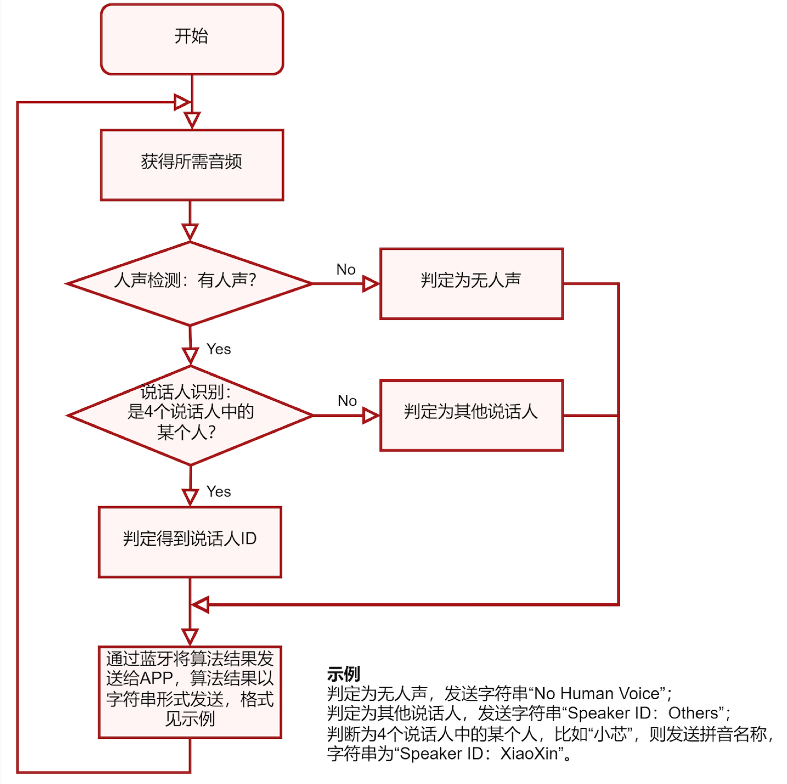

# 决赛设计文档 - 算法设计部分

## 二、算法设计

### 1. 总体设计思路

基于决赛赛题要求（识别四个特定人"小芯"、"小原"、"小思"、"小来"和"其他说话人"），本项目采用**两级级联算法架构**：第一级为语音活动检测（VAD），第二级为说话人识别（SPK）。这种设计充分考虑了嵌入式平台的资源限制（RAM < 256KB）和实时性要求，通过VAD预过滤减少后续计算负担，同时保证识别准确性。

算法整体设计遵循以下核心原则：
- **轻量化架构**：采用单卷积层+全连接层的简洁设计，最大化参数效率
- **多设备兼容**：通过加权多设备数据训练，确保PC开发与板载部署的一致性
- **知识蒸馏思想**：VAD阶段采用Silero教师模型自动标注，提高标签质量和模型收敛性
- **端到端量化**：全流程INT8量化，保证嵌入式部署的高效性



### 2. 语音活动检测（VAD）算法设计

#### 2.1 设计目标与技术挑战

**设计目标**：
- 准确区分人声与非人声片段（音乐、环境噪声、动物声等）
- 处理延迟 < 1秒，满足实时性要求
- 模型大小 < 3KB，适配嵌入式资源约束

**技术挑战**：
- 多类型噪声干扰（环境声、音乐、动物叫声）
- 低功耗要求下的精度保证
- PC训练与RISC-V部署的数值对齐

#### 2.2 数据预处理策略

##### 2.2.1 分层数据集构建

采用**权重平衡**的数据集划分策略：

| 阶段 | 处理内容 | 技术要点 |
|------|----------|----------|
| **Stage 0** | 原始数据分类 | 文件级按时长加权分割（8:1.2:0.8），确保各类数据均匀分布 |
| **Stage 1** | 音频拼接分割 | 按类别拼接后均匀切分为1秒片段，避免文件边界效应 |
| **Stage 2** | 幅度归一化 | 逐片段最大值归一化：$x_i^{norm} = \frac{x_i}{\max_j |x_j|}$ |
| **Stage 3** | SNR数据增强 | 多信噪比混音（-3dB, 0dB, 10dB），扩充数据集至3倍 |

**噪声类别平衡**：将四类声音（voice、env、music、blank）按3:1:1:1比例平衡，确保人声与噪声样本比例为1:1，避免类别偏置。

##### 2.2.2 Silero教师模型自动标注

**理论依据**：基于知识蒸馏理论，教师模型的软标签比人工硬标签更容易被学生模型学习。如Caruana等人在KDD 2006中指出，教师模型输出的概率分布包含更丰富的特征关系信息，能显著提高学生模型的收敛速度和泛化能力。

**实现策略**：
- **教师模型**：Silero VAD（预训练，32ms分辨率）
- **标注流程**：每1秒音频片段→31个32ms概率值→平均概率>0.5判定为人声
- **优势**：避免人工标注主观性，提供一致性更强的训练标签

#### 2.3 MFCC特征工程

##### 2.3.1 参数配置策略

针对嵌入式平台优化的MFCC参数：

| 参数 | 取值 | 设计理由 |
|------|------|----------|
| **FFT长度** | 256点 | 匹配31帧分割，平衡频率分辨率与计算复杂度 |
| **梅尔滤波器** | 40个 | 充分覆盖语音频谱范围（0-4kHz） |
| **DCT系数** | 13维→12维 | 去除C0直流分量，专注谱包络特征 |
| **帧数** | 31帧 | 1秒音频在256点窗口下的最大帧数 |

##### 2.3.2 嵌入式对齐设计

**PC-QEMU数值对齐**：
- 实现与NMSIS-DSP库完全一致的MFCC计算
- 预计算滤波器组、DCT矩阵和窗函数系数
- 使用RFFT计算幅度谱，确保定点运算精度

#### 2.4 模型架构设计

##### 2.4.1 网络结构

**轻量化单卷积设计**：
```
Input: (31, 12, 1) MFCC特征
├── Conv2D(4 filters, 3×3, same padding)
├── ReLU Activation
├── AveragePooling2D(31×12) - 全局平均池化
├── Flatten()
└── Dense(2, sigmoid) - 二分类输出
```

**架构优势**：
- **参数效率**：总参数770个（2.8KB），远低于内存限制
- **计算简化**：单层卷积+全局池化，减少中间特征图存储
- **量化友好**：分离ReLU激活，优化INT8量化效果

### 3. 说话人识别（SPK）算法设计

#### 3.1 设计目标与技术创新

**设计目标**：
- 准确识别四个目标说话人（小芯、小原、小思、小来）
- 有效检测未知说话人（Others类别）
- 支持多设备录音条件下的鲁棒识别

**技术创新点**：
- **创新9×12卷积核设计**：时域9帧捕获音素过渡，频域12维满卷积感知绝对频率位置
- **多设备加权训练**：解决PC开发与板载部署的域偏移

#### 3.2 多设备数据融合策略

##### 3.2.1 分层数据集架构

**数据来源分布**（总计35,000样本）：
```
├── BOARD: 15,000样本 (42.9%) - 目标部署平台原始录音，权重最高
├── DIY: 9,000样本 (25.7%) - 使用比赛板端重新录制的自制数据集
├── PHONE: 3,000样本 (8.6%) - 移动设备录音
├── IPAD: 3,000样本 (8.6%) - 平板设备录音  
├── PC: 3,000样本 (8.6%) - 桌面设备录音
└── OTHERS: 2,000样本 (5.7%) - 背景/未知说话人
```

**加权策略理由**：
- **部署平台优先**：BOARD数据占比43%，确保模型与目标硬件特性匹配
- **DIY数据增强**：使用比赛发放的VeriHealthi开发板重新录制部分音频，确保训练数据与实际部署环境的麦克风特性、ADC特性、信号链路完全一致，占比25.7%体现了对板端适配的重视
- **跨设备泛化**：多设备数据覆盖不同录音条件和信道特性
- **自适应采样**：通过`adjust_array_length()`函数处理设备间数据不平衡

##### 3.2.2 PC-板端对齐技术

**对齐挑战**：
- NMSIS-NN库卷积边界填充策略未知
- 量化参数在不同平台的数值差异
- 全连接层实现细节的平台相关性

**解决方案**：
- **逐层对比验证**：分别比较卷积、池化、全连接层输出
- **手动全连接实现**：绕过库函数差异，确保数值一致性
- **量化参数标准化**：统一multiplier和shift计算方法

#### 3.3 创新卷积架构设计

##### 3.3.1 9×12卷积核理论基础与创新设计

**核心设计思想**：与传统CNN采用小尺寸卷积核（如3×3）不同，本方案创新性地采用9×12大尺寸卷积核，其中频域维度12正好等于MFCC特征维度，实现了"满维度卷积"的概念。

**满维度卷积的技术优势**：
- **全局频域注意力**：类似于注意力机制中的全局注意力，12维满卷积能够同时关注整个频谱范围，实现频域的"全局感受野"
- **消除频域滑动**：传统3×3卷积在频域方向滑动，会丢失频率的绝对位置信息，而满维度设计避免了这种信息损失
- **保持频谱结构**：12维满卷积一次性处理整个频谱，完整保持共振峰的空间分布关系，类似于自注意力保持序列全局关系
- **增强位置敏感性**：每个滤波器都能感知从低频到高频的完整模式，实现对说话人特定频谱分布的全局建模

##### 3.3.2 维度设计的声学理论依据

**时域维度（9帧）**：
- **语音学意义**：9帧×32ms = 288ms，覆盖典型音素长度
- **说话人特征**：捕获说话人特定的音素过渡模式
- **计算效率**：单次卷积替代多层小卷积，减少内存访问

**频域维度（12系数）**：
- **满维度设计理念**：卷积核宽度12正好等于MFCC特征维度（去除C0后），实现频域方向的完全覆盖
- **全局频域建模**：类似于Transformer中的全局注意力，每个卷积滤波器都能"看到"整个频谱，实现频域的全局信息交互
- **绝对频率位置感知**：与传统3×3小卷积不同，12维满卷积无频域滑动，能够直接学习频率的绝对位置关系，这对说话人识别至关重要
- **频谱模式完整性**：一次卷积操作即可捕获从低频到高频的完整频谱模式，避免频域信息的分片处理
- **共振峰全局关系**：说话人的共振峰分布具有全局性特征，满维度卷积能够同时感知F1、F2、F3等多个共振峰的相对位置关系，实现类似注意力机制的全局建模能力

##### 3.3.3 512滤波器设计

**容量平衡**：
- **表征能力**：512个滤波器提供足够的特征抽象能力
- **参数控制**：相比多层网络，单层大卷积参数更可控
- **嵌入式适配**：量化后模型大小约22KB，满足内存约束


### 4. 模型量化与部署优化

#### 4.1 INT8量化策略

##### 4.1.1 量化数学原理

**量化映射关系**：
$$M = \frac{s_x \cdot s_w}{s_{out}}$$

**multiplier和shift计算**：
- 选择 $n \in [0,31]$ 使 $2^n M \in [0.5,1)$
- 存储 $multiplier = round(2^n M \cdot 2^{31})$ (Q0.31格式)
- 存储 $shift = n$
- 运行时计算: $(acc \times multiplier) >> (31 + shift)$

##### 4.1.2 量化参数优化

**校准数据集**：使用前100个训练样本，确保量化分布代表性

**量化配置**：
```python
converter.optimizations = [tf.lite.Optimize.DEFAULT]
converter.target_spec.supported_ops = [tf.lite.OpsSet.TFLITE_BUILTINS_INT8]
converter.inference_input_type = tf.int8
converter.inference_output_type = tf.int8
```

#### 4.2 C代码生成与NMSIS-NN集成

##### 4.2.1 参数导出自动化

**卷积层参数**：
- 权重数组：OHWI格式排列（512×9×12×1）
- 偏置数组：512个元素
- 量化参数：per-channel multiplier和shift

**全连接层参数**：
- 权重矩阵：512×5展平存储
- 偏置向量：5个元素
- 量化参数：统一multiplier和shift

##### 4.2.2 内存布局优化

**RISC-V适配**：
```c
// 卷积层配置
#define SPK_CONV_OUT_CH    512
#define SPK_CONV_KH        9
#define SPK_CONV_KW        12  
#define SPK_CONV_OUT_H     23  // (31-9+1)
#define SPK_CONV_OUT_W     1   // (12-12+1)

// 量化参数
.input_offset  = 25
.output_offset = -128
.activation    = {128, 127}
```

### 5. 后处理与系统集成

#### 5.1 指数平滑后处理

**算法原理**：
$$y_t = \alpha x_t + (1-\alpha) y_{t-1}, \quad \alpha = 0.2$$

**应用策略**：
- 对SPK输出logits进行平滑，提高识别稳定性
- 遇到VAD检测的非语音段时重置平滑状态
- 利用说话人切换时通常伴随静音的语音学特性

#### 5.2 二级级联推理流程

**实时处理流程**：
1. **音频分割**：8kHz PCM → 8000样本/秒
2. **MFCC提取**：31帧×12系数特征矩阵
3. **VAD检测**：人声/非人声二分类
4. **条件SPK**：仅对人声段执行说话人识别
5. **结果输出**：格式化BLE传输

**输出格式规范**：
- 无人声：`"No Human Voice"`
- 已知说话人：`"Speaker ID: XiaoXin"`
- 未知说话人：`"Speaker ID: Others"`

### 6. 技术创新点总结

#### 6.1 算法创新

1. **知识蒸馏VAD**：利用Silero教师模型自动标注，提高训练效率
2. **9×12满维度联合卷积**：时域9帧覆盖音素长度，频域12维满卷积实现类似全局注意力的频域建模，单层网络具备全局感受野能力
3. **多设备加权训练**：解决跨设备部署的域适应问题

#### 6.2 工程创新

1. **DIY数据集制作**：使用比赛实际板端重新录制训练数据，确保硬件链路一致性
2. **端到端量化**：从浮点训练到INT8部署的完整流程
3. **PC-QEMU对齐**：解决跨平台数值一致性难题
4. **自动化参数导出**：TFLite模型到C代码的无缝转换
5. **NMSIS-NN深度集成**：充分利用RISC-V神经网络加速库

### 7. 性能指标与预期效果

#### 7.1 模型性能

**VAD模型**：
- 验证集准确率：77.8%
- 模型大小：2.8KB
- 推理延迟：<50ms

**SPK模型**：
- 模型大小：22KB（量化后）
- 支持类别：5类（4个目标+Others）
- 预期准确率：>90%（目标说话人）

#### 7.2 系统性能

**实时性能**：
- 处理延迟：<1秒/片段
- 内存占用：<50KB（运行时）
- 更新频率：1Hz（可配置）

**鲁棒性能**：
- 跨设备适应性：支持Board/PC/Phone/iPad
- 噪声鲁棒性：适应真实环境录音条件
- 说话人泛化：有效识别训练集外的未知说话人

通过以上系统性的算法设计，本方案在保证识别准确性的同时，充分考虑了嵌入式部署的资源约束和实时性要求，为VeriSilicon Cup决赛提供了技术先进、工程可行的完整解决方案。