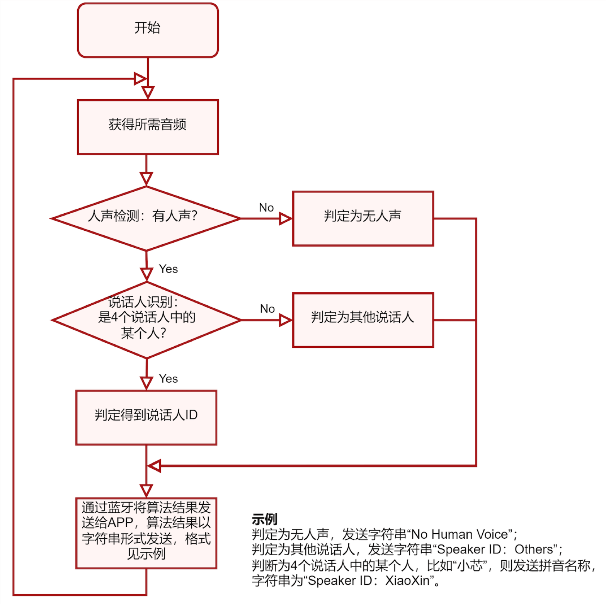

基于VeriHealthi SDK的语音数据采集、蓝牙发送及人声检测和说话人识别算法实现
请基于主办方提供的VeriHealthi开发板、SDK及语音数据集，完成语音原始数据实时采集和算法结果的蓝牙发送，实现人声检测和说话人识别。
嵌入式：
1. 创建speech_task，用于读取PDM数据；创建audio_task，用于音频播放；创建algo_task，用于算法处理接收到的speech数据；创建ble_task，用于发送蓝牙数据；
2. 使用SDK提供的HAL_PDM接口，在speech_task里实现PDM的初始化、配置和控制；
3. 通过PDM中断处理函数，获得语音原始数据的状态更新，判断接收到足够量的语音数据后发送Event给algo_task及ble_task进行算法处理及蓝牙发送；
4. 使用SDK提供的HAL_I2S和HAL_CODEC接口，实现音频播放功能；
5. 在audio_task的manager里处理注册的Event，收到Event后调用自己实现的音频播放接口，播放指定的音频内容；
6. VESC APP通过“VeriSilicon Speech Recognition” Service 的 “Control” Characteristic发送“开始运行”或“结束运行”命令给开发板；开发板嵌入式软件根据收到的命令，启动或停止算法运行，同时发送Event给audio_task用于请求播放“开始”或“结束”音频；
7. 在algo_task的manager里处理注册的Event，调用自己实现的算法接口对语音原始数据进行处理；
8. 结合语音算法，实现相关状态机，通过蓝牙 “VeriSilicon Speech Recognition” Service的 “Speech Recognition Result” Characteristic向手机发送要求格式的语音识别结果；
9. VESC APP通过“VeriSilicon Speech Recognition” Service 的 “Raw Data” Characteristic发送“开启”或“关闭”语音原始数据发送命令；收到“开启”命令后，开发板嵌入式软件将采集到的语音原始数据按照主办方提供的数据包格式封装，并通过蓝牙 “VeriSilicon Speech Recognition” Service的 “Speech Raw Data Value” Characteristic持续向VESC APP发送；收到“关闭”命令后，停止发送。
算法：
1. 用主办方提供的语音数据集，进行人声检测和说话人识别算法的实现；
2. 人声检测算法用于识别是否有人声活动；
3. 说话人识别算法用于识别当前说话人的身份。主办方将提供指定4个人的语音数据及对应人员ID（“小芯”，“小原”，“小思”，“小来”）。算法需要能够识别出语音数据中的人声是否属于4个人中的某个人：如果“是”，则给出对应人员ID；如果“否”，则需判定为“其他说话人”；
4. 读取开发板PDM数据，将算法识别结果通过BLE发送到App，完成算法验证。
要求：
1. 嵌入式开发禁止在中断处理函数里直接调用PDM或CODEC接口，禁止在中断函数里使用非ISR类型的OS及Event接口，禁止在算法处理里直接打印识别结果；
2. VESC APP上“算法识别”开关的使用要求：
	· 点击“开始”，VESC APP 通过蓝牙将命令发送到开发板，开发板播放“开始”音频，算法开始运行；
	· 点击“结束”，VESC APP 通过蓝牙将命令发送到开发板，开发板播放“结束”音频，算法结束运行；
3. VESC APP上“原始数据发送”开关的使用要求：
	· 当APP端设置为“开启”时，设备端需将收到的语音原始数据通过蓝牙发送给VESC APP；
	· 当APP端设置为“关闭”时，无需发送原始数据；
4. 实现算法处理与原始数据发送同时工作，且功能运行正常，可额外加分；
5.  嵌入式开发的消息需要通过Event传递；
6.  根据如下定义，实现BLE service：
Service
	Description: VeriSilicon Speech Recognition Service
	UUID：0000 0001-0003-1000-8000-00805F9B05B5
	Type：Primary Service
	Include service: None
	Characteristic1：
		Description: Speech Raw Data Value
		UUID：0000 0008-0003-1000-8000-00805F9B05B5
		Properties: Read | Notify
		Permission: Read
		Value data size: 512 Bytes
		备注：该特征值用来向手机发送语音采样原始数据。每次最多可传送512Bytes数据。
	Characteristic2：
		Description: Speech Recognition Result
		UUID：0000 0009-0003-1000-8000-00805F9B05B5
		Properties: Read | Notify
		Permission: Read
		Value data size: 32 Bytes
		备注：该特征值用来向手机发送语音识别结果。
	Characteristic3：
		Description: Control
		UUID：0000 000A-0003-1000-8000-00805F9B05B5
		Properties: Write | Read
		Permission: Write | Read 
		Value data size: 1 Byte
		备注：1 表示启动算法运行，0 表示停止算法运行。
	Characteristic4：
		Description:  Raw Data
		UUID：0000 000B-0003-1000-8000-00805F9B05B5
		Properties: Write | Read
		Permission: Write | Read 
		Value data size: 1 Byte
		备注：1 表示开启语音原始数据发送，0 表示关闭语音原始数据发送。
7. 请使用决赛数据集中“小芯”，“小原”，“小思”，“小来” 4个说话人的数据作为正样本（请勿使用初赛数据集中“小芯”、“小原”说话人的数据作为正样本，初赛和决赛数据集中的正样本为不同人）；
8. 人声检测、说话人识别算法需要按以下流程进行实现，并按要求给出算法结果，算法流程如下：
	· 点击VESC APP“算法识别”开关开始算法运行；
	· 以T秒的频率更新算法结果，T的数值由参赛选手自行决定, 建议T在[0.5, 4]之间；
	· 每次识别时：先进行人声检测，再进行说话人识别；
	· 人声检测时：检测到无人声，则给出“No Human Voice”判定结果；若检测到有人声，则进行说话人识别；
	· 说话人识别时：识别到当前说话人属于主办方指定4个人中的某个人，则给出结果“Speaker ID: XX”（例，“Speaker ID: XiaoXin”）；识别到当前说话人不在4个人中，则给出结果“Speaker ID: Others”。

说明：
1. 用于大赛开发和测试的VESC APP（iPhone或Android版本）由主办方提供；
2. VESC APP上语音原始数据统计功能包括原始数据的总数据量统计、实际采样率计算和数据准确性统计；其中数据准确性通过CRC8校验来判断，CRC8计算可使用HAL_CRC接口所调用的硬件CRC模块，也可自行用软件实现（方案选择不影响评分结果）；
3. 音频播放由音频子板的耳机孔输出，“开始”和“结束”对应音频由主办方提供；
4. 可在开发板上临时使用VeriHealthi_MIC_Data.img采集语音数据，作为算法训练等用途；
5. 由于各手机或iPad的蓝牙性能不相同，每次能传输的最大数据量并不能保证为512字节；若出现传输失败，可使用ble_get_cur_mtu函数得到Characteristic1每次能传输的最大数据量；
6. 为了保证蓝牙数据传输速率，请使用蓝牙版本不低于5.0的手机或iPad；
7. 主办方提供了语音数据集“VeriHealthi_SR_Dataset_v2.0.zip”用于算法的训练和测试，参赛者可根据实际需求添加自采数据集进行训练； 
8. 主办方提供的数据集包含电脑和手机采集的语音数据，以及VeriHealthi开发板采集的语音数据； 
9. 算法需最终完成C代码实现、集成以及在开发板上的调试、性能优化和功能展示；
10. 算法结果的字符串格式，请参考“VeriHealthi_SR_Dataset_v2.0/readme.pdf”；
11. 算法实现需要考虑硬件资源的限制（参看开发手册），请注意算法模型的复杂度；
12. 请注意实现内存管理功能的高效性和安全性；
13. 请优先使用SDK里的Event System；
14. 请注意算法处理的实时性；
15. 请仔细阅读开发手册，错误的接口使用会影响评分；
16. VeriHealthi开发板和VESC APP交互示意图如下：

提交内容：
1. 源代码：包括嵌入式端源代码、编译完成的.out和.img文件，算法相关源代码（算法部分需提交仿真代码和最终实现的C代码）；
2. 视频录制，包含完整的声音播放、App界面内容显示及开发板状态：
	· 蓝牙原始数据采集：蓝牙连接，原始数据采集过程及声音回放；
	· 算法准确性测试（3次）：播放主办方的音频文件进行人声检测和说话人识别测试（需包含正样本和负样本），并录制视频；
3. 设计文档，包含方案介绍、算法设计、软件工作流程、验证及测试结果，团队介绍及分工等；
4. 现场答辩PPT（现场答辩后提交）。
公开测试方式（现场答辩）：
1. 测试设备：VeriHealthi开发板，iPad Air5（由主办方提供）
2. 测量流程：
	a. 蓝牙原始数据采集：蓝牙连接，打开并进行原始数据采集，声音回放；
	b. 算法识别准确性测试：现场工作人员（4人）及参赛选手按照固定语音流程进行实际人声测试，测试包含正样本语音和负样本语音；
	c. 流程b进行过程中，同时检查“开始”和“结束”音频播放的正确性，及语音原始数据与算法处理是否同时开启且功能运行正常；
	d. 查看数据记录图表中的统计结果；
* 现场答辩时间安排：PPT演讲-8min，公开测试-4min，现场问答-4min。
评分标准：
1. 代码：代码结构、功能完成度、系统稳定性等：30分
2. 算法：模型、流程设计思路等：20分
3. 设计文档：5分
4. 自测结果：队员自测提交报告及视频，代码实测结果等：5分
5. 现场公开测试结果 
	— BLE数据传输完整性：6分
	— 开始/结束音频播放及正确性：6分
	— 算法准确性：20分
	— 语音原始数据与算法处理同时开启且功能运行正常：额外加5分
6. 现场答辩表现力：8分