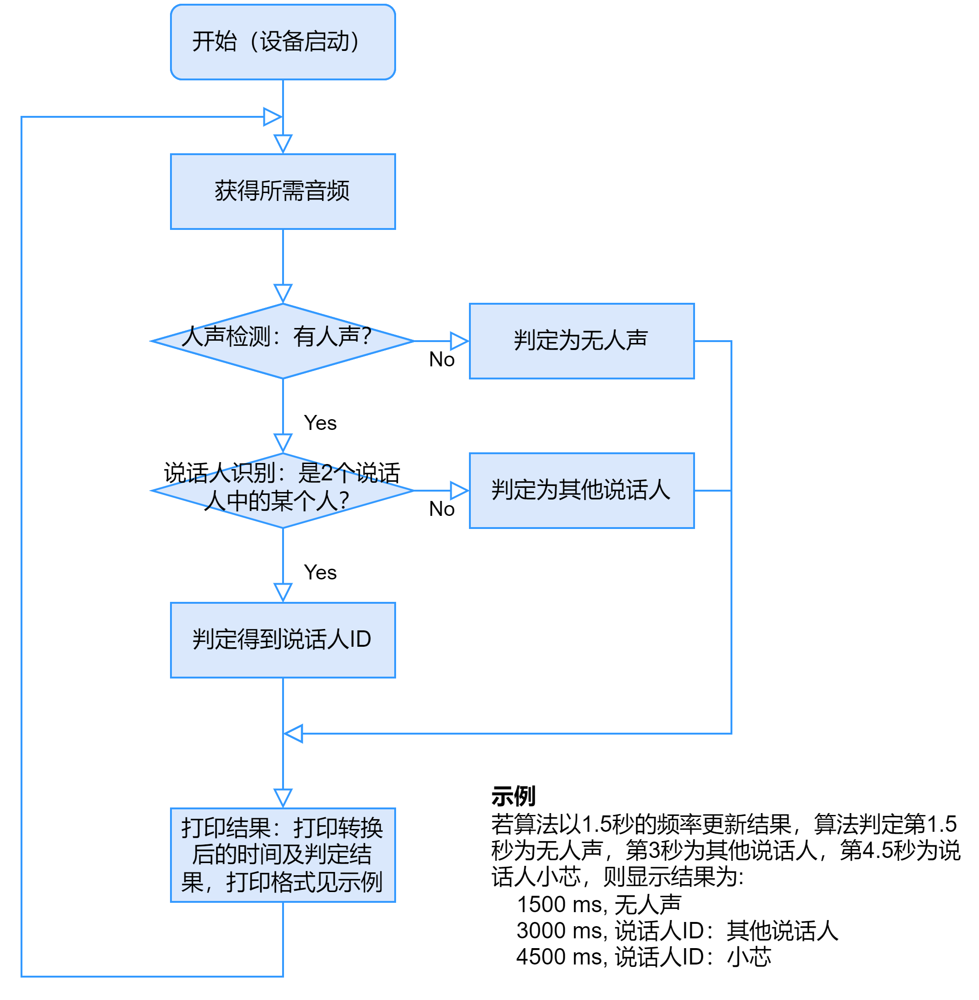

初赛赛题
初赛所需SDK、开发手册和数据集，我们将以邮件的方式发送给到各团队的联系邮箱。
初赛开发基于VeriHealthi QEMU SDK，不涉及硬件开发平台。
初赛作品提交通道将于2025年6月16日24:00关闭。
初赛作品提交：使用zip压缩，上传至SFTP的Incoming目录。压缩文件名规则：赛区-学校名-队伍名称-队长姓名-初赛，如：北部-X大-ABC队-李xx-初赛.zip。
一、基于VeriHealthi SDK的语音数据采集，并完成人声检测和说话人识别算法的实现
随着语音交互应用的普及，声音成为了我们新的身份钥匙。人声检测及说话人识别等技术，通过声纹特征比对，确认用户身份，可防止未授权访问，为语音支付、设备控制、敏感信息查询等场景提供安全保障。请基于主办方提供的VeriHealthi SDK及语音数据集，完成语音数据采集及人声检测和说话人识别算法的实现，并使用采集到的数据完成算法验证。
嵌入式：
1. 创建speech_task，用于读取PDM数据；创建algo_task，用于算法处理接收到的speech数据；
2. 使用SDK提供的HAL接口，在speech_task里实现PDM的初始化和配置；
3. 通过PDM中断处理函数获得语音PCM格式数据的状态更新，判断接收到足够量的语音数据后发送Event给algo_task进行算法处理；
4. 在algo_task的manager里处理Event，调用自己实现的算法接口对语音PCM数据进行处理，并将结果通过printf接口打印出来；
算法：
1. 用主办方提供的语音数据集，进行人声检测和说话人识别算法的实现；
2. 人声检测算法用于识别是否有人声活动：
3. 说话人识别用于识别当前说话人的身份。主办方将提供指定2个人的语音数据及对应人员ID（“小芯”，“小原”）。算法需要能够识别出语音数据中的人声是否属于2个人中的某个人：如果“是”，则给出对应人员ID；如果“否”，则需判定为“其他说话人”
4. 在VeriHealthi SDK中读取语音数据，完成算法验证。
要求：
1. 嵌入式开发禁止在中断处理函数里直接调用PDM接口，禁止在中断函数里使用非ISR类型的OS及Event接口，禁止在算法处理里直接打印识别结果；
2. 人声检测、说话人识别算法需要按以下流程进行实现，并按要求给出算法结果，算法流程如下：
	- 设备启动即开始运行算法，以T秒的频率更新算法结果，T的数值由参赛选手自行决定, 建议T在[0.5, 4]之间；
	- 每次识别时：先进行人声检测，再进行说话人识别；
	- 人声检测时：检测到无人声，则给出“无人声”判定结果；若检测到有人声，则进行说话人识别；
	- 说话人识别时：识别到当前说话人属于主办方指定2个人中的某个人，则给出结果“说话人：XX”（例，“说话人ID：小芯”）；识别到当前说话人不在2个人中，则给出结果“说话人ID：其他说话人”；
	- 打印结果时：需同步统计当前算法已处理的输入音频数据量，并根据采样率和通道数转换为时间，以毫秒显示。

说明：
1. 初赛QEMU SDK内置PDM模拟器，可查阅开发手册PDM模拟器章节获得详细信息；
2. 实现高效且安全的语音PCM数据的内存管理功能是加分项；
3. 可以使用FreeRTOS原生接口实现嵌入式功能，但使用SDK里的Event System是加分项；
4. 主办方提供了一个小型的语音数据集“VeriHealthi_SR_Dataset.zip”用于算法的训练或测试，参赛者可根据实际需求添加自采数据集进行训练；
5. 主办方提供的数据集包含电脑和手机采集的语音数据，以及VeriHealthi开发板采集的语音数据；
6. 算法结果的打印规则，请参考“VeriHealthi_SR_Dataset/readme.pdf”；
7. 算法实现需要考虑硬件资源的限制（参看开发手册），请注意算法模型的复杂度。
二、基于VeriHealthi SDK的BLE GATT Service开发
BLE应用：
在VeriHealthi SDK中，添加一个私有的GATT Service。
要求：
1. 请参考VeriHealthi SDK手册7.4节-自定义GATT Service；
2. Service 定义如下：
Service
	Description: VeriSilicon Speech Recognition Service
	UUID：0000 0001-0003-1000-8000-00805F9B05B5
	Type：Primary Service
	Include service: None
	Characteristic1：
		Description: Speech Raw Data Value
		UUID：0000 0008-0003-1000-8000-00805F9B05B5
		Properties: Read | Notify
		Permission: Read
		Value data size: 512 Bytes
		备注：该特征值用来向手机发送语音采样原始数据。每次可通知最多可传送512 Bytes数据。
	Characteristic2：
		Description: Speech Recognition Result
		UUID：0000 0009-0003-1000-8000-00805F9B05B5
		Properties: Read | Notify | Indicate
		Permission: Read
		Value data size: 8 Bytes
		备注：该特征值用来向手机发送语音识别结果。
* 提交内容
1. 提交可成功编译的完整工程文件；
2. 算法需另单独提交仿真Python或Matlab代码；
3. 设计文档，包含方案介绍、算法设计、软件工作流程、验证及测试结果、团队介绍及分工等；
4. 视频录制，包含完整的功能验证流程，包括项目编译、运行和结果打印。
* 技术评分考核点
1. 嵌入式/算法开发：代码结构，功能完成度，系统稳定性，语音数据完整性，算法结果准确性等；
2. BLE应用开发：编译通过即可，无需运行；正确使用gatt.h中提供的宏工具；Service参数正确；
3. 文档：完整性，可读性等；
4. 视频：完整性。